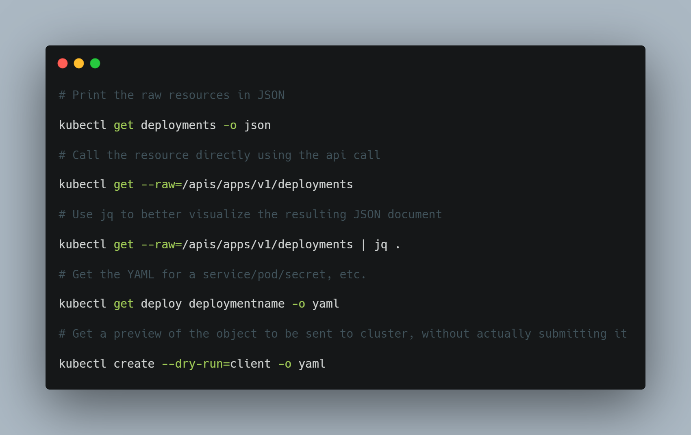

# DevOps Tip 10

**Extend kubectl and create your own commands using raw outputs**

The `kubectl` command provides a summarized view of the resources stored by the apiserver. There are many more fields stored by the apiserver that are not shown. We can use the kubectl get command with the raw resource output to create our own visualization and commands.<br>

For example:

- We can print the raw resources in JSON with the following command:

```
kubectl get deployments -o json
```

- We can call the resource directly querying the apiserver:

```
kubectl get --raw=/apis/apps/v1/deployments
```

- We can even combine the output with tools like jq to provide different visualizations, filter the output, or feed the output to other tools for advance automation.<br>

In the example below, we call the Kubernetes API to return all deployments and the output is a raw, unformatted JSON document. As this is very confusing to see it in a terminal, we can use jq (a lightweight and flexible command-line JSON processor) to visualize the JSON structure:

```
kubectl get --raw=/apis/apps/v1/deployments | jq .
```

- We could also use -o yaml  to get the YAML for a service/pod/secret, etc.:

```
kubectl get deploy deploymentname -o yaml
```

where `deploymentname` is the name of the service/pod/secret.

- Lastly, we could use create  with the `--dry-run=client` flag so that the resources aren't created and we get a preview of the object that would be sent to our cluster, without actually submitting it:

```
kubectl create --dry-run=client -o yaml
```

For more information about `kubectl` usage conventions, see this [link](https://kubernetes.io/docs/reference/kubectl/conventions/). To learn more about `jq`, check [here](https://stedolan.github.io/jq/).




