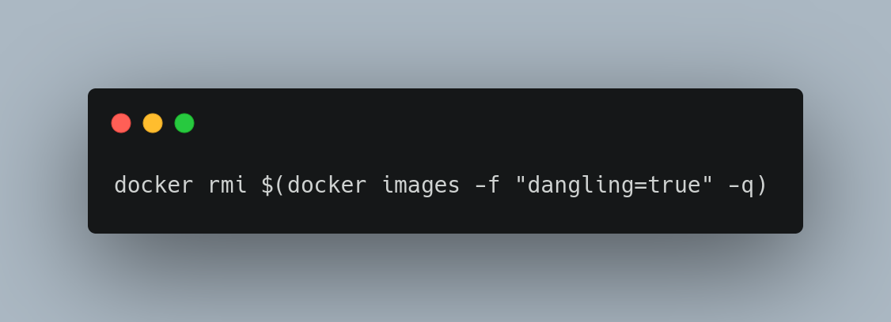

# DevOps Tip 2

This another useful command, that could help you clean up docker images quickly.

`$ docker system prune`

This will clean all of  docker images that are not used by any container, any non used networks, any non tagged images, docker is going to prompt a confirmation before you could proceed. 

You could also clean volumes by specifying `--volumes` option.

Check:

`$ docker system prune --help`

