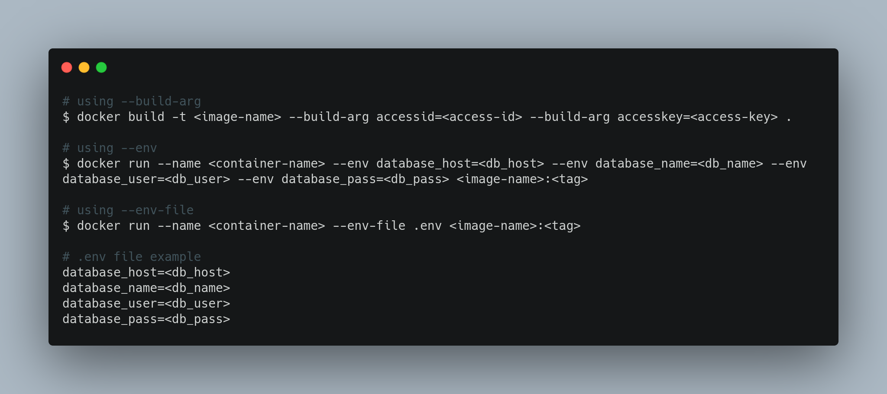

# DevOps Tip 4

When using docker it's very important that you keep your secrets safe, let's say you have to install a monitoring application inside your container that requires an access id and access key to get installed, a best way to pass the secrets safely is by using build arguments as follows:

`
docker build -t <image-name> --build-arg accessid=<access-id> --build-arg accesskey=<access-key> .
`

in the same context, you may need to pass secrets to you application like database credentials, a good way to do this by handling the credentials as  environment variables in code level and pass them to the docker container on runtime, for that we have two options:

- Passing the environment variables as parameters:

`
docker run --name <container-name> --env database_host=<db_host> --env database_name=<db_name> --env database_user=<db_user> --env database_pass=<db_pass> <image-name>:<tag>
`

- Passing  the environment variables in a file:<br>
In this case you put your secrets inside ```.env``` file.

`
docker run --name <container-name> --env-file .env <image-name>:<tag>
`

and the .env file will look like this:

`
database_host=<db_host>
database_name=<db_name>
database_user=<db_user>
database_pass=<db_pass> 
`


