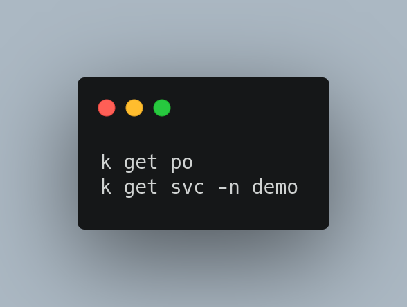

# DevOps tip 5

**Setup `bash-completion` and use `bash aliases`**

Kubectl is the main tool for interacting with kuberenets clusters, as a DevOps person you will be using a lot kubectl commands, a good way to make things more easier for you is by setting up `bash-completion` and use `bash aliases`

* Install bash-completion

`$ sudo apt-get install bash-completion`
or 
`$ sudo yum install bash-completion`

* Reload your run and shell

`$ type _init_completion`

* Add bash-completion to bashrc

`echo 'source <(kubectl completion bash)' >>~/.bashrc`

* Setup and alias for kubectl and enable completion for it:

```
echo 'alias k=kubectl' >>~/.bashrc
echo 'complete -F __start_kubectl k' >>~/.bashrc
```

* Use case:


