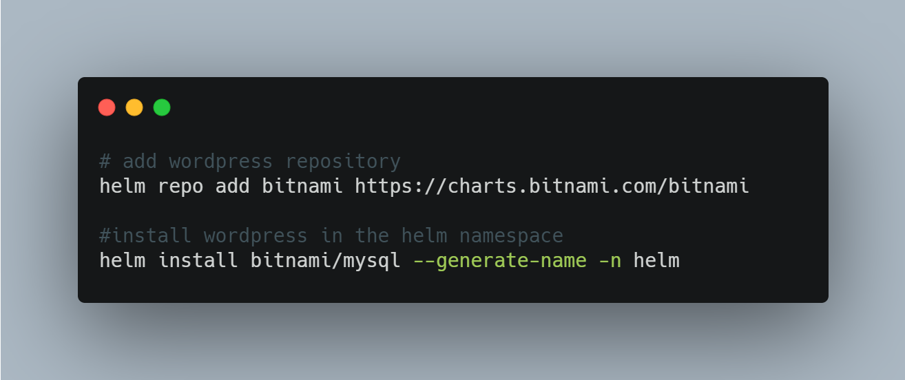

# DevOps Tip 6

**Using Helm to install an application, tool, or service inside Kubernetes Cluster**

To deploy an application, numerous actions need to be done, e.g. apply deployment, service, etc. Installing Helm can help us providing the clusters more easily as Helm automates the creation of each resource separately, e.g. service, deployment, config maps, secrets, etc. For example, if you want to deploy a WordPress application, you can run commands in the attached picture.

You can follow [this](https://helm.sh/docs/intro/quickstart/) to get started with Helm and read [this](https://helm.sh/docs/intro/using_helm/) to understand deeper on how to use Helm.

