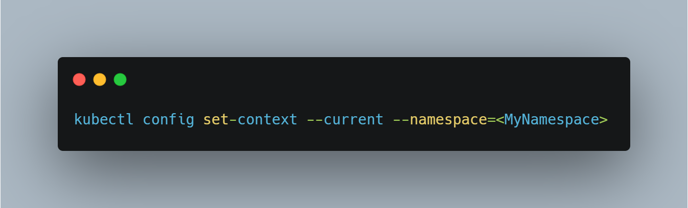

# DevOps Tip 7

**Setting a default namespace**

A Kubernetes cluster can be divided into multiple environments by using namespaces.<br>

One disadvantage of `kubectl` commands is that every time we write a command, we have to add the `--namespace option` at the end. As people typically forget this, they find themselves creating for example pods, services, or deployments in the wrong namespace. In order to avoid this, we can set a namespace preference before running `kubectl` commands.<br>

Specifying the namespace in the YAML files is a bad practice as that prevents using the same YAML file for different namespaces (like for example for dev & prod namespaces).<br>

By running the command below before executing the `kubectl` commands, the namespace `<MyNamespace>` will be saved for all subsequent `kubectl` commands for your current context:

```kubectl config set-context --current --namespace=<MyNamespace>```

where `<MyNamespace>` is the name of the namespace you want to set as default.<br>

If you want to read more about Namespaces in Kubernetes, check this [link](https://kubernetes.io/docs/concepts/overview/working-with-objects/namespaces/).<br>




