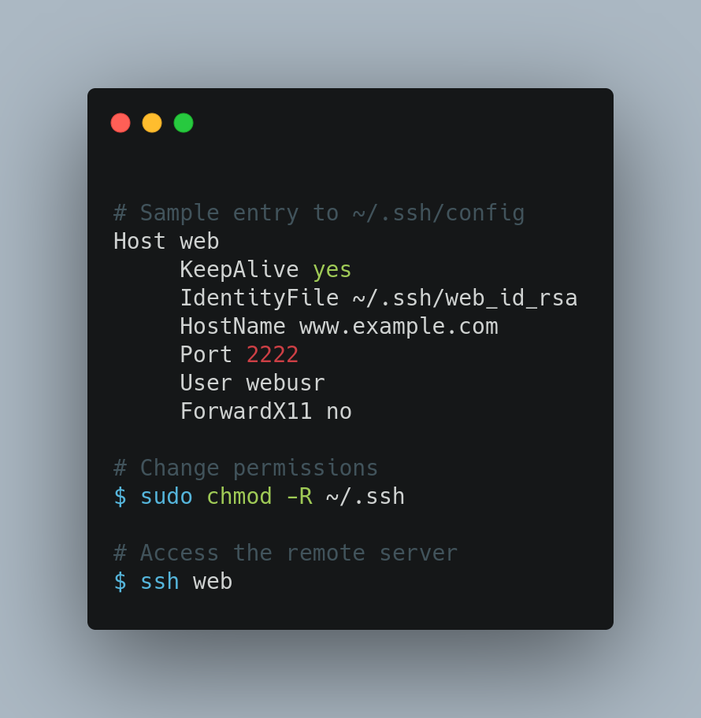

# DevOps Tip 8

**Easy way to ssh to servers**

As a DevOps Engineer you will be using Linux a lot, and you may have several remote servers that you accessing with ssh , for that you will need something like this to do so:

`$ sudo ssh -i key.pem user@host -p <port>`

In order to make you life easier you could whether use a tool like `Remmina` in linux or stick to the default shell and add the ssh entries you have into ~/.ssh/config as below:

```
Host web
     KeepAlive yes
     IdentityFile ~/.ssh/web_id_rsa
     HostName www.example.com
     Port 2222
     User webusr
     ForwardX11 no
```

Also don't forget to allow access  to non root users to the directory ~/.ssh as follows:

`$ sudo chmod -R ~/.ssh`

After this you will be able to access your server just by hitting `$ ssh web`




