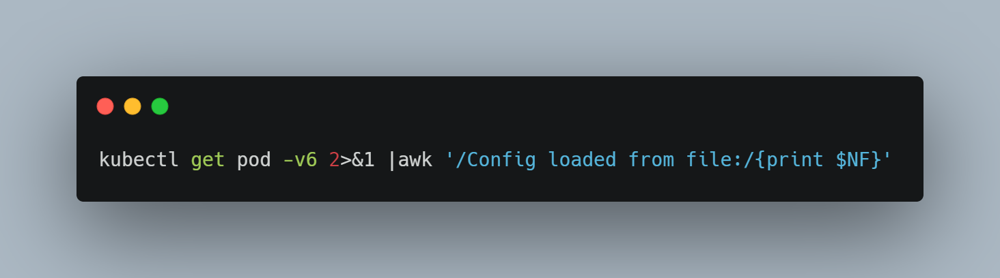

# DevOps Tip 9
**Locate Kubeconfig in existing cluster**

Kubeconfig by default located in `~/.kube/config`, but there are some cases where you move the config file into another location. In case you forget where you place your config file, then you can run this command (assuming you're in Linux)

```kubectl get pod -v6 2>&1 |awk '/Config loaded from file:/{print $NF}'```

