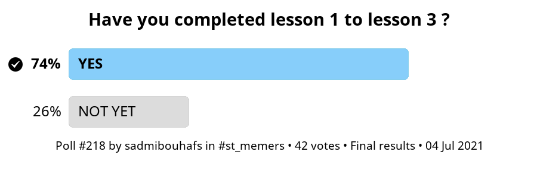
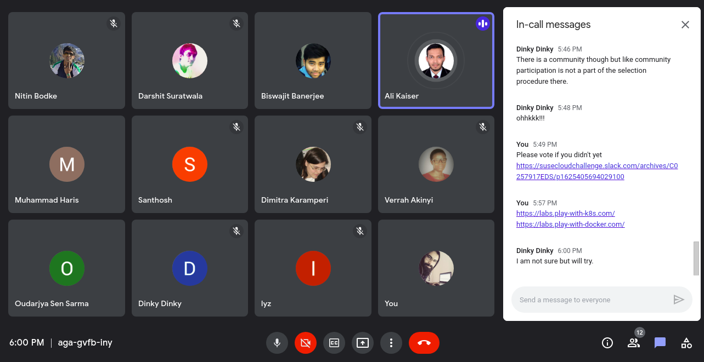

# Memers 1st Support Session

I'm very happy that most of fellow students are on track with the course, most of us are at least in lesson 3 which is good progress.

Here are some links shared during our session:

If you facing performance issues setting up docker, vagrant and virtualbox, try using `Minikube` or `kind` which will help you create a kubernetes cluster in your local host machine, in this case you may not need to use k3s as minikube provides kubernetes it self.

There are useful online platforms that provides access to labs online, that you could use to get your hands dirty.

* Docker --> https://labs.play-with-docker.com/ / https://www.docker.com/play-with-docker/

* Kubernetes --> https://labs.play-with-k8s.com/

Using free tiers from cloud providers also could be a good option in case your machine is unable to handle the load, refer to this thread for more.

* Learn DevOps and more with real work scenarios using https://www.katacoda.com/
* Join kubernetes communiy if you want to learn more https://kubernetes.slack.com/

Thanks for joining
@NitinBodke @DSdatsme @Biswajit @AliKaiser.Bangladesh @Haris.Muhammad @Santhosh.G.S @Dimitra.Karamperi @Verrah @Oudarjya @Dinky.Dudeja @lyz @ayu @AbhiNay @Gowthami.Wudaru @ayo.adebayo

Milestone 1 poll:

Team photo:

