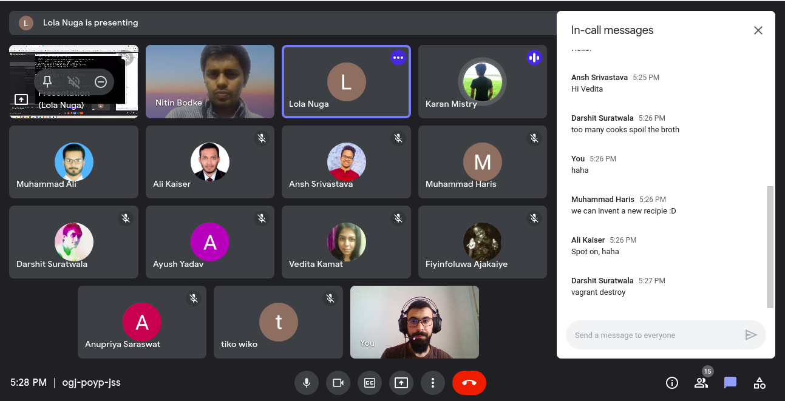

# Memers 2nd Support Session

Big thanks everyone for joining today's support session, I enjoyed being with you and having all those discussions while we tackling the issues.

So if anyone using a laptop with 4 cpu core and having issues with vagrant, virtualbox..etc, try editing the vagrant file and set the cpus to 2(it set to 4 in initial) and run it again.

If you having vagrant in aborted status use `vagrant destroy` to clean up old installation and start again.
For deploying `busybox` in k8s you have to setup the container to access the shell by `tty=true` or run an infinite loop like `command: ["sleep", "infinity"]` (Check the attached yaml file).


```yaml
apiVersion: apps/v1
kind: Deployment
metadata:
  labels:
    app: busybox
  name: busybox
spec:
  replicas: 2
  selector:
    matchLabels:
      app: busybox
  template:
    metadata:
      labels:
        app: busybox
    spec:
      containers:
      - image: busybox
        name: busybox
        tty: true
#        command: ["sleep", "infinity"]
```

Solutions for windows issues(shared by @AliKaiser.Bangladesh):


<object data="./Solution for Windows with Ubuntu Errors.pdf" type="application/pdf" width="700px" height="700px">
    <embed src="./Solution for Windows with Ubuntu Errors.pdf">
        <p>This browser does not support PDFs. Please download the PDF to view it: <a href="./Solution for Windows with Ubuntu Errors.pdf">Download PDF</a>.</p>
    </embed>
</object>

Kudos @NitinBodke @Olly @Karan.Mistry.India @Muhammad.Ali @AliKaiser.Bangladesh @Ansh @Haris.Muhammad @DSdatsme @ayu @Vedita.Kamat @Fiyin @Anupriya.Saraswat @Aimane.kahil.suse @Dinky.Dudeja @Verrah @Biswajit @Benson.Gikonyo @June.Muoti @AhlamM


