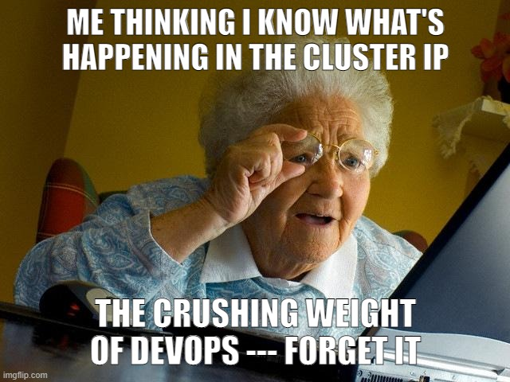
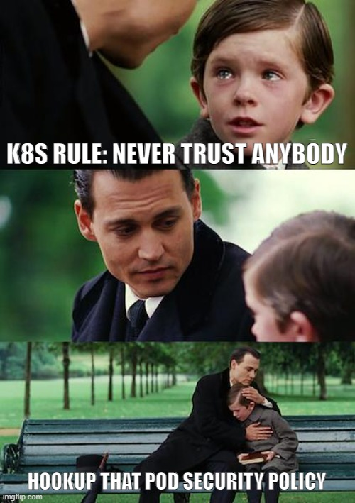
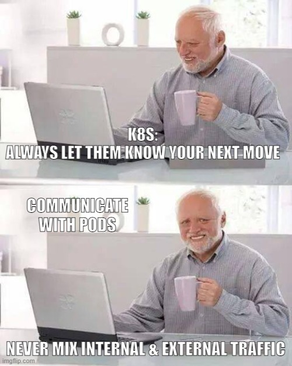
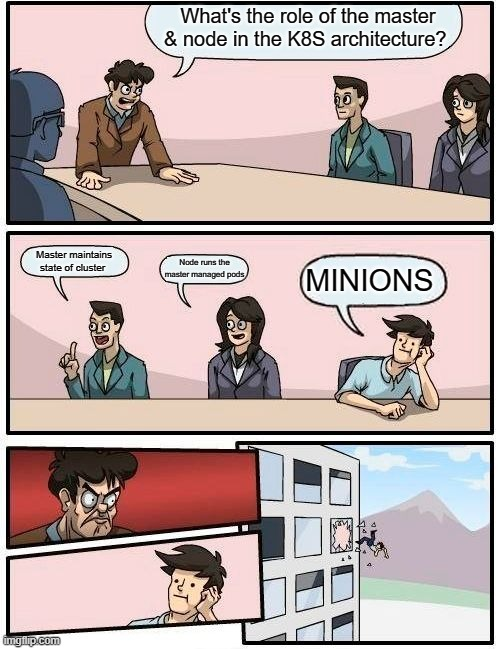

## Friday, July 9th 2021

*Here's the second post of the series* 

***Tell It With a Meme: Cloud Containers & Kubernetes*** 
:one:
Deploying microservices on Kubernetes is complicated. One needs to understand what's happening with every component inside of the cluster to really service it. It is critical to consider resources for automatically collecting logs/metrics and understanding what’s happening on Kubernetes. This involves a combination of configuring the runtime logging setting and retention of a particular cluster.

:two:
Kubernetes pod security policy is a cluster-level resource that controls security-sensitive aspects of pod specification. The resource defines a set of conditions for a pod to be accepted into the systems.

:three:
The most powerful things about Kubernetes architecture is how it manages the network. The Cluster IP does not expose services externally, rather it provides an IP to communicate internally within the cluster. In case of some sort of vulnerability that allows access to one of the pods, with the right policy, the vulnerability will not penetrate the entire network

:four:
ROLES OF THE MASTER NODE

- Maintaining the desired state of the cluster
- Indicating a set of processes used to manage the cluster
- Contains info, API, scheduler, and replication controller

ROLES OF THE WORKER NODE

Also known as the minion, it:
- Contains the services for running the pods managed by the master
- Contains kubelet, services, pods and containers
- Offers services including container runtime, kubelet and kube-proxy

