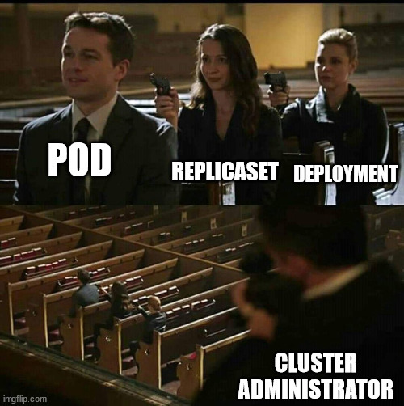
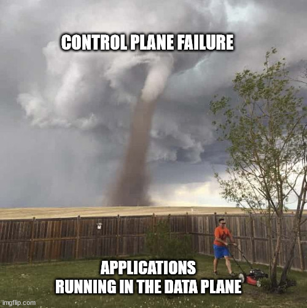

## Sunday, July 18th 2021

*Here's the third post of the series* 

***Tell It With a Meme: Kubernetes Diving Deeper*** 

***Workload hierarchy***

A ReplicaSet ensures that a specified number of pod replicas are running at any given time. However, a Deployment is a higher-level concept that manages ReplicaSets and provides declarative updates to Pods along with a lot of other useful features. Therefore, we recommend using Deployments instead of directly using ReplicaSets, unless you require custom update orchestration or don't require updates at all.

This actually means that you may never need to manipulate ReplicaSet objects: use a Deployment instead, and define your application in the spec section.

***Secrets***

Kubernetes Secrets let you store and manage sensitive information, such as passwords, OAuth tokens, and ssh keys. Storing confidential information in a Secret is safer and more flexible than putting it verbatim in a Pod definition or in a container image.

However, note that Kubernetes Secrets are, by default, stored as unencrypted base64-encoded strings. By default they can be retrieved - as plain text - by anyone with API
access, or anyone with access to Kubernetes' underlying data store, etcd. In order to safely use Secrets, it is recommended you (at a minimum):
1. Enable Encryption at Rest for Secrets.
2. Enable or configure RBAC rules that restrict reading and writing the Secret. Be aware that secrets can be obtained implicitly by anyone with the permission to create a Pod.

***Cluster Failure***

Failures can happen at the cluster-level, for example, a control plane failure. In this case, a subset or all control plane components are compromised. While the situation is disastrous, the applications are still running and handling traffic. The downside of the control plane failure is that no new workloads can be deployed and no changes can be applied to the existing workloads.

The engineering team needs to recover the control plane components as a critical priority. However, they should not worry about recovering applications, as these will be intact and still handling requests.

