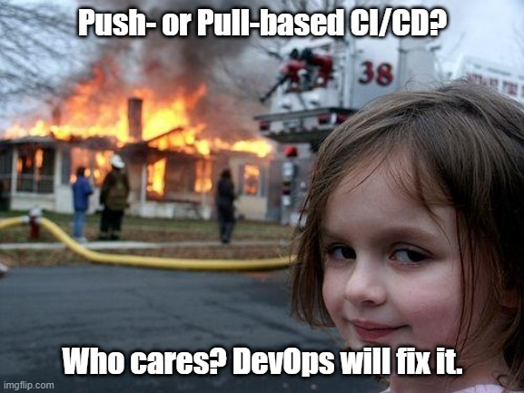

## Sunday, July 25th 2021

*Here's the fourth post of the series* 

***Tell It With a Meme: CI/CD - Push- or Pull-based?*** 

***:pushpin: Push-based CI/CD model:*** 

In this approach, a CI/CD pipeline is used to push changes to the environment. The pipeline is triggered when a code commit or merge happens. The code is then packaged and distributed using an image registry (DockerHub). The Continuous Delivery stage is triggered once the YAML manifests are updated to reference the new image tag and a Continuous Delivery tool then pushes the updated manifests to multiple clusters (Kubernetes).

:heavy_check_mark: Simplicity: It uses well-understood CI/CD tooling so it can be the most accessible to the broadest set of engineers in a company.

:heavy_check_mark: Efficiency: Standardizing on the same deployment methodology for both cloud native and traditional workloads can increase the efficiency. By reducing cognitive overhead, onboarding and training new team members becomes easier, while ensuring existing team members focus on solving problems instead of understanding multiple technologies.

:heavy_check_mark: Optimized bandwidth: With push-style GitOps, we get the best of two worlds: fast, low-latency deployments while minimally taxing our network and tooling.

:heavy_multiplication_x: Major disadvantage: Changes should be actively propagated to all environments.

***:pushpin: Pull-based CI/CD:***

An agent running inside the environment continually polls the Git repo and/or container registry for changes. When it detects a mismatch between the defined state and the running state, the agent pulls the defined configuration into the environment. In this approach, the release process is still be triggered by a developer that pushes new features to the source code. The packaging of the application is similar, resulting in a new image stored in DockerHub. However, once the YAML manifests are updated with the new image tag, a pull-based Continuous Delivery tool identifies new changes and applies them to a Kubernetes cluster.

:heavy_check_mark: Security: With pull-pased GitOps we can enjoy reduced security and compliance risk. As the CD agent is running inside of the cluster, there is no need to store credentials in the external CI.

:heavy_check_mark: Simplicity and Efficiency: If all or the majority of your workloads are running in Kubernetes, then using an agent to pull in deployments can be the simple and efficient choice. This model simplifies the process of application releases, as new features can be applied automatically as soon as they are available.

:heavy_multiplication_x: Flexibility: Most pull-style GitOps agents only run in Kubernetes. If we want to deploy to anything other than Kubernetes, we’ll need to push the configuration to that environment, meaning that we actually use a push approach.

:heavy_multiplication_x: Optimized bandwidth: Having a Kubernetes agent continually polling your Git repo for changes may not be a problem with a few clusters, but at scale, this can mean a major consumption of network resources. Additionally, the Git and container registry tooling can come under significant load if it needs to process requests from hundreds of clusters continually polling for state. Of course, we could reduce the polling interval, but then we would also increase latency between code commit and deployment.

***:pushpin: Conclusion:***

While each style is different, both approaches have their benefits. The most important thing is to build a deployment pipeline that fits the business requirements closely and automates the release process. There is no "golden path" that would cover all engineering requirements. We should always keep in mind the ultimate goal which is to ship code securely, automatically, and reliably.

