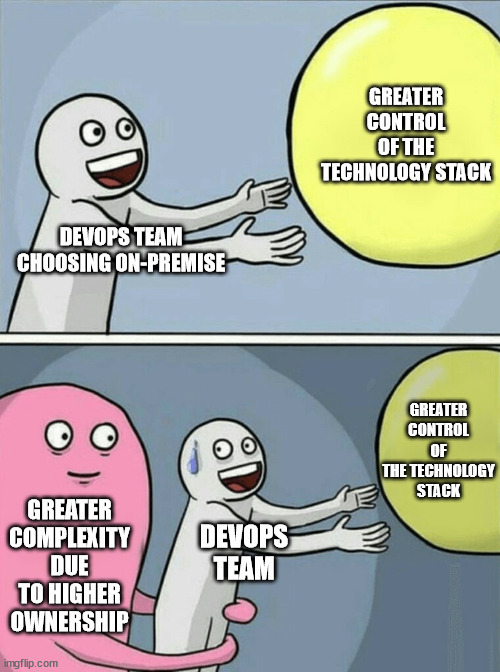
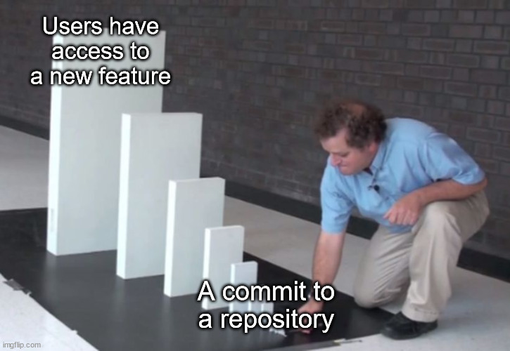

## Sunday, August 01st 2021

*Here's the fifth and final post of the series* 

***Tell It With a Meme:*** 

***Cloud Computing Services:*** 

Cloud computing services are categorized on the basis of the level of abstraction of the technology stack. Some categories are:.

:heavy_check_mark: On-premises: The team is responsible for managing all the layers of the technology stack.

:heavy_check_mark: Infrastructure as a Service (IaaS): The team consumes network, storage, and compute resources from a vendor.

:heavy_check_mark: Platform as a Service (PaaS): The team focuses only on the application development as the application now runs on a platform provided by the vendor.

These categories can be considered as a pyramid with on-premises being at the bottom, IaaS in the middle, and PaaS at the top.

As you move from top to bottom, you:

- gain more control over the technology stack since fewer layers are abstracted by the vendor
- deal with more complexity since you have ownership over more layers

As you move from bottom to top, you:
- can develop and deploy your applications more quickly
- become more susceptible to vendor lock-in as you lose control over layers

***Continuous Integration, Delivery, Deployment:***

:heavy_check_mark: Continuous Integration (CI) is a mechanism that produces a package of an application that can be deployed. Code changes are merged to a central repository multiple times a day. Each merge triggers an automated build and testing sequence for the given project.

:heavy_check_mark: Continuous Delivery (CD) is a practice of automating the entire software release process. The idea is to do CI and then automatically prepare and track a release to production. The continuous delivery process typically includes at least one manual step of approving and initiating a deploy to production.

:heavy_check_mark: Continuous Deployment is a step up from Continuous Delivery in which every change in the source code is deployed to production automatically, without explicit approval from a developer. A developer’s job typically ends at reviewing a pull request from a teammate and merging it to the master branch. A CI/CD service takes over from there by running all tests and deploying the code to production, while keeping the team informed about the outcome of every important event.

