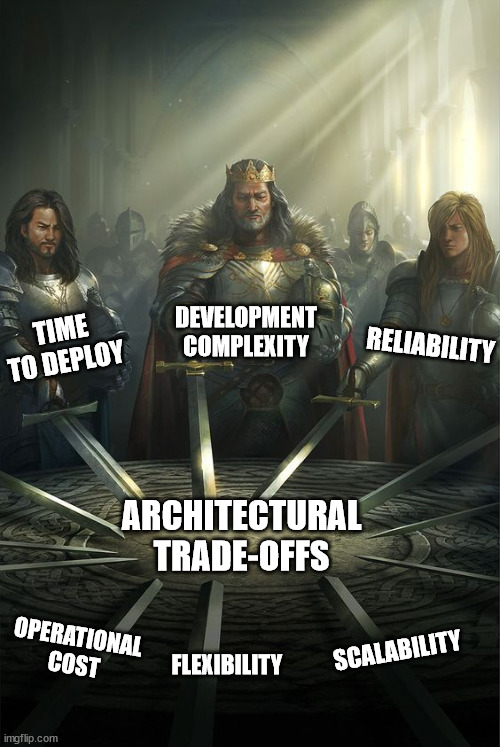
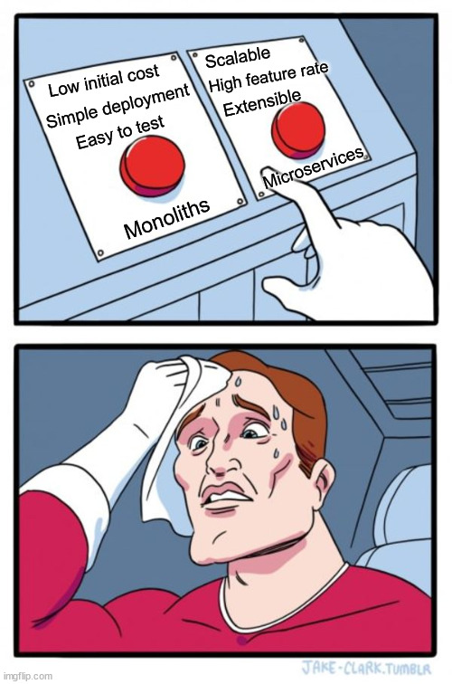

# Tell It With A Meme

## Sunday, July 4th 2021

*Presenting...*

**Tell It With A Meme** 

* Get ready to learn cloud-native concepts in a manner we all enjoy: memes! 

* A brief textual explanation of the concept is also provided for better understanding 

* Every Friday and Sunday, we'll be releasing memes on specific concepts learnt throughout this course. 

This series is brought to you by:

@Dimitra.Karamperi 
@Ghano 
@Joshua.DCunha 
@Vedita.Kamat 
@Verrah 
@Vijay.Bhargav.Reddy 

_____________________

*Here's the first post of the series* 

***Tell It With a Meme: Architectural Trade-offs*** 

Each application architecture has a set of trade-offs that needs to be considered at the genesis of a project. 
But it is also important to understand how the application will be
maintained in the future e.g. at scale, under load, supporting multiple
releases a day, etc. 
The categories that are used to evaluate trade-offs are: 
- <b>Development complexity:</b> The effort required to deploy and manage the application
- <b>Scalability:</b> The ability of an application to respond to incoming traffic appropriately
- <b>Time to deploy:</b> The building of an application through a delivery pipeline to ship features
- <b>Flexibility:</b> The ability of an application to adapt to new technologies or introduce new features
- <b>Operational cost:</b> The cost of resources to release the application
- <b>Reliability:</b> The ability of an application to recover from failure and its provisions for monitoring and observability

